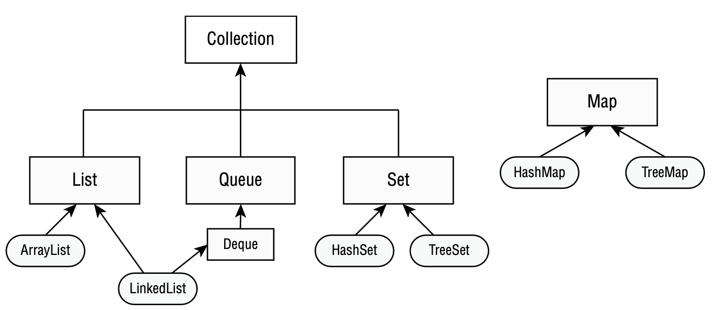

# Collections

There are four main interfaces in the Java Collections Framework.

List: A list is an ordered collection of elements that allows duplicate entries. 
    Elements in a list can be accessed by an int index.

Set: A set is a collection that does not allow duplicate entries.

Queue: A queue is a collection that orders its elements in a specific order for processing.
    A Deque is a subinterface of Queue that allows access at both ends.

Map: A map is a collection that maps keys to values, with no duplicate keys allowed. 
    The elements in a map are key/value pairs.

